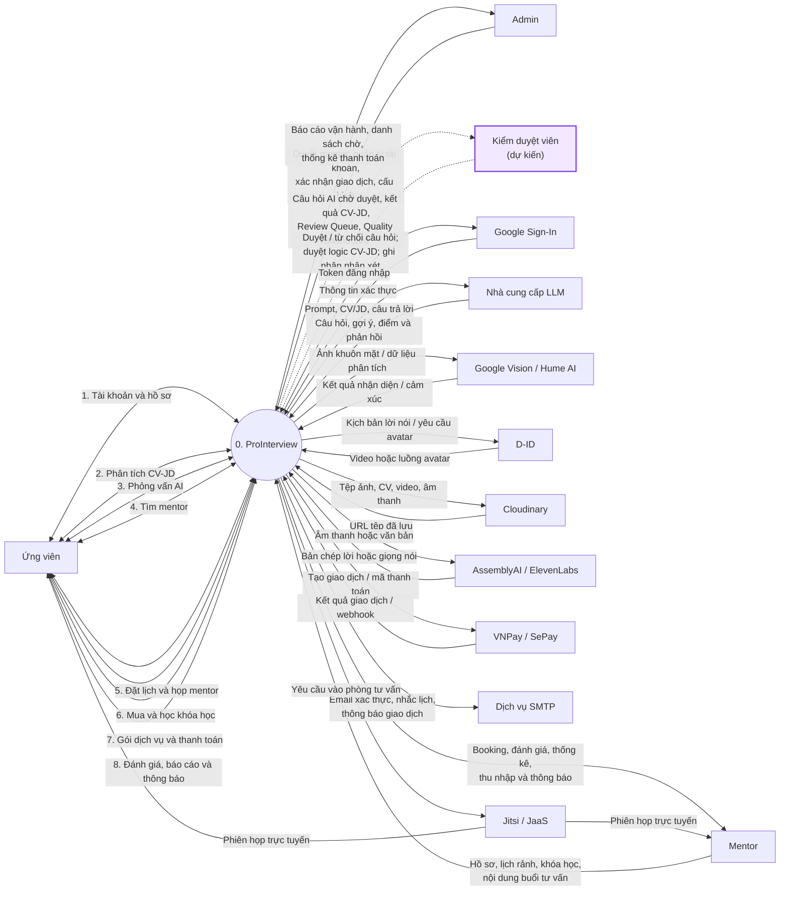
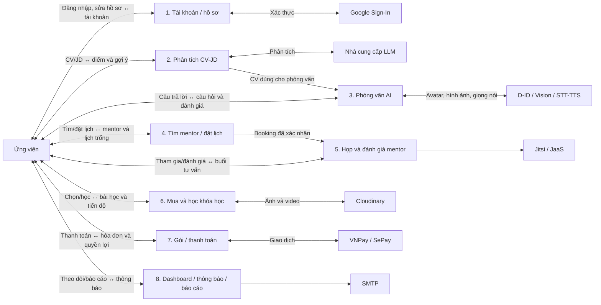
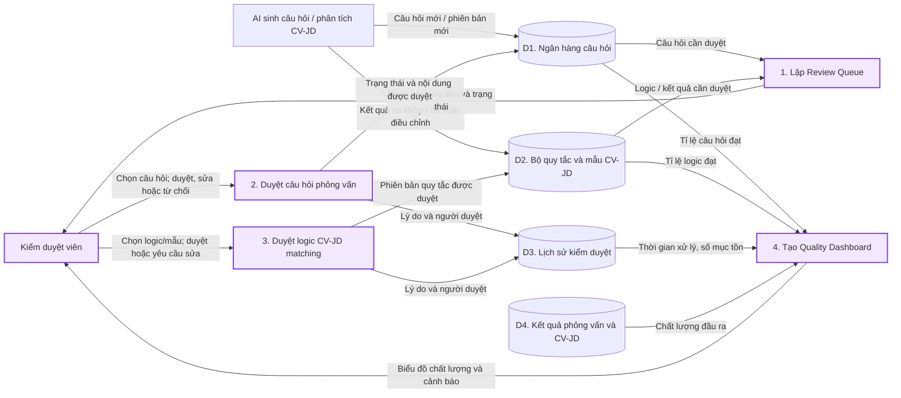

# Context diagram — ProInterview

Tài liệu này mô tả toàn bộ ProInterview như **một hệ thống duy nhất**. Vai trò **Kiểm duyệt viên** và các luồng kiểm duyệt trong ảnh yêu cầu là **tính năng dự kiến**: hiện tại `User.role` chỉ có `customer`, `mentor`, `admin`. Đường nét đứt biểu thị luồng dự kiến.

**Bản theo mẫu học thuật (trắng đen, vòng tròn trung tâm, mũi tên một chiều):** [`PROINTERVIEW_CONTEXT_MAU.drawio`](PROINTERVIEW_CONTEXT_MAU.drawio). Xem nhanh qua [`PNG`](PROINTERVIEW_CONTEXT_MAU.png) hoặc [`SVG`](PROINTERVIEW_CONTEXT_MAU.svg). Bản này gồm 40 luồng dữ liệu riêng và mở trực tiếp để chỉnh sửa trong draw.io.

**Mở trực tiếp trong draw.io:** dùng file [`PROINTERVIEW_CONTEXT.drawio`](PROINTERVIEW_CONTEXT.drawio). File có ba trang, tất cả ô và đường nối đều chỉnh sửa được. Vào **File → Open From → Device**, chọn file, rồi đổi trang bằng thanh tab ở cuối cửa sổ.

## 1. Sơ đồ ngữ cảnh (DFD mức 0)

### Tám luồng dữ liệu của Ứng viên

| Nhóm | Ứng viên gửi vào hệ thống | Hệ thống trả về |
|---|---|---|
| Tài khoản | Đăng ký, đăng nhập, xác thực email/Google, sửa hồ sơ | Phiên đăng nhập, trạng thái tài khoản, hồ sơ |
| CV-JD | File CV/JD, ngành nghề cần phân tích | Điểm phù hợp, kỹ năng, gợi ý cải thiện, lịch sử phân tích |
| Phỏng vấn AI | Vị trí ứng tuyển, CV, câu trả lời, âm thanh/hình ảnh khi bật tính năng | Câu hỏi, avatar, transcript, điểm, nhận xét, lịch sử phiên |
| Tìm mentor | Từ khóa, bộ lọc, mentor được chọn | Hồ sơ mentor, đánh giá, lịch trống |
| Đặt lịch và họp | Khung giờ, yêu cầu đặt/đổi/hủy lịch, phản hồi buổi họp | Xác nhận booking, trạng thái, liên kết phòng tư vấn |
| Khóa học | Lựa chọn khóa học, giỏ hàng, câu hỏi bài học, tiến độ | Nội dung bài học, ghi danh, tiến độ, chứng chỉ nếu đủ điều kiện |
| Gói và thanh toán | Chọn gói, thanh toán/chuyển khoản | Trạng thái giao dịch, quyền lợi gói, hóa đơn |
| Theo dõi và phản hồi | Yêu cầu dashboard, đánh giá mentor/khóa học, báo cáo sự cố | Thống kê cá nhân, thông báo, lịch sử hoạt động |

**Ranh giới hệ thống:** React frontend, Express backend, FastAPI `cv_jd_matching` và cơ sở dữ liệu MongoDB đều thuộc ProInterview, nên không tách thành thực thể ngoài ở sơ đồ mức 0. Các dịch vụ ngoài được nêu theo khả năng tích hợp của code; việc hoạt động thực tế phụ thuộc cấu hình môi trường. VNPay có nhánh thanh toán thật khi cấu hình khóa; MoMo/ZaloPay ở luồng khởi tạo hiện trả về mock.

## 2. Phóng to luồng Ứng viên

Trang 02 trong file `.drawio` trình bày tám nhóm trên thành các chức năng riêng và nối chúng với dịch vụ liên quan. Đây là **sơ đồ phóng to**, không thay thế context diagram mức 0.

## 3. Phóng to phần Kiểm duyệt viên (DFD mức 1 — đề xuất)

Sơ đồ này **không phải context diagram**; nó phân rã phần kiểm duyệt để làm rõ bốn tính năng trong yêu cầu.

## Cách vẽ trên draw.io

1. Mở file `.drawio` ở trên để chỉnh sửa trực tiếp. Nếu muốn tạo sơ đồ từ mã, vào **Arrange → Insert → Advanced → Mermaid** và dán từng khối Mermaid.
2. Nếu vẽ tay, đặt `0. ProInterview` ở giữa; người dùng bên trái, dịch vụ bên ngoài bên phải.
3. Dùng hình chữ nhật cho tác nhân/dịch vụ, hình tròn hoặc hình bo góc cho hệ thống, mũi tên có nhãn cho dữ liệu trao đổi.
4. Giữ đường của Kiểm duyệt viên ở dạng nét đứt cho đến khi vai trò và các quy trình này được triển khai.

## Căn cứ từ code

- `backend/src/models/User.js`: role hiện có là `customer`, `mentor`, `admin`.
- `backend/src/app.js`: các module auth, mentor, booking, payment, course, CV và interview.
- `backend/src/routes/auth.js`, `backend/src/routes/interviews.js`, `backend/src/routes/bookings.js`: tài khoản, phiên phỏng vấn và lịch mentor của ứng viên.
- `backend/src/routes/courses.js`, `backend/src/routes/cart.js`, `backend/src/routes/enrollments.js`, `backend/src/routes/notifications.js`: mua/học khóa học, tiến độ và thông báo.
- `backend/src/routes/cvMatch.js`: Express gọi dịch vụ FastAPI phân tích CV/JD.
- `backend/src/services/paymentsService.js` và `backend/src/routes/payments.js`: VNPay, chuyển khoản/SePay và webhook.
- `backend/src/services/avatarService.js`, `backend/src/services/jaasService.js`, `backend/src/services/emailService.js`: avatar, phòng họp và email.
